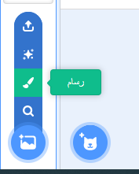
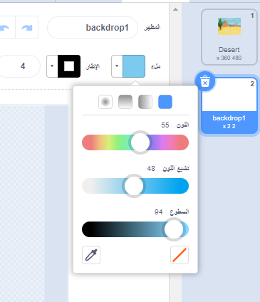
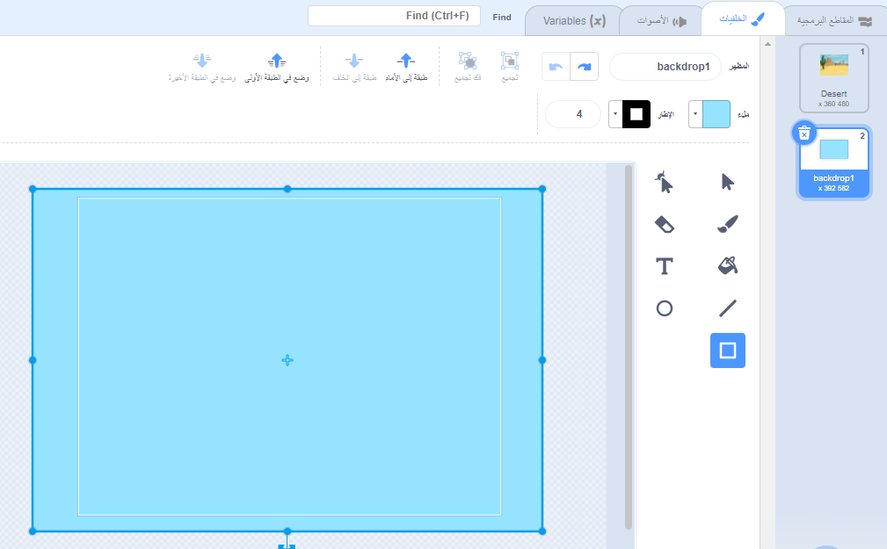
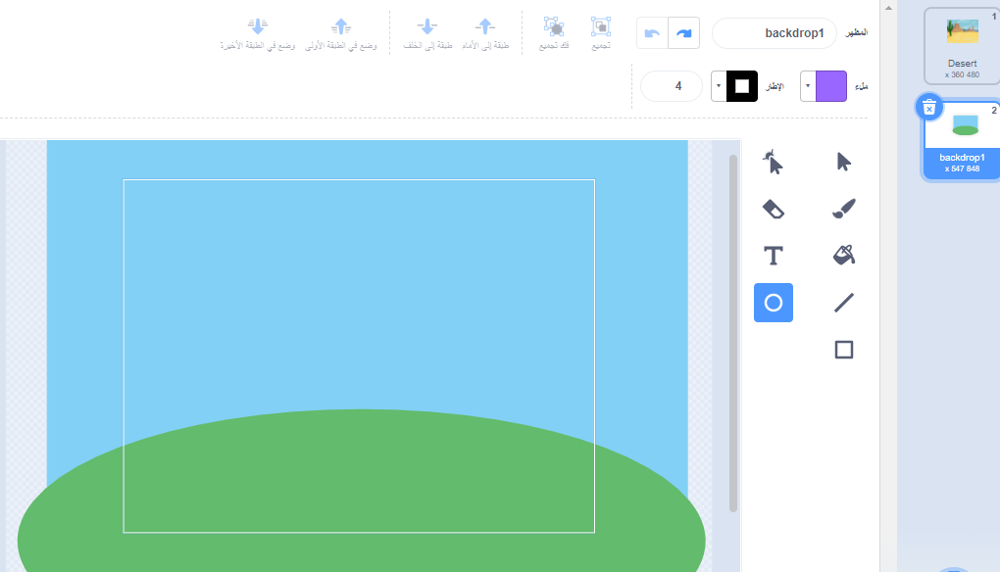
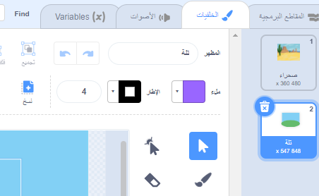

اذهب إلى القائمة **اختر صورة خلفية** وانقر على **الرسام**:

سيتم نقلك إلى محرر الرسام ، حيث سيتم تمييز الخلفية الجديدة في القائمة. إذا كان لديك خلفيات أخرى في مشروعك ، فستراهم أيضًا في القائمة.

لتعيين اللون الرئيسي للخلفية ، انقر فوق **Rectangle** ، ثم استخدم **Fill** لتحديد لون ، ثم اسحب الشكل فوق لوحة الخلفية الكاملة:

 

إذا كنت ترغب في إضافة المزيد من التفاصيل إلى الخلفية ، يمكنك استخدام أداة **مستطيل** **دائرة** أو **رسام** - أو مزيج من الثلاثة!

عند الانتهاء ، تأكد من إعطاء الخلفية الجديدة اسمًا منطقيًا:

ستظهر خلفيتك الجديدة على المنصة وستكون متاحة للاستخدام في مجموعات `الهيئة`{:class="block3looks"}.

