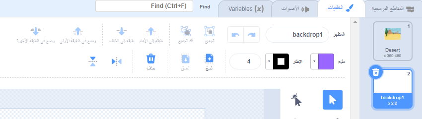

انقر فوق **رسم** من القائمة **اختر خلفية**

سيتم نقلك إلى محرر رسام السكراتش مع إبراز الخلفية الجديدة. إذا كان لديك خلفيات أخرى في مشروعك ، فستراهم أيضًا في القائمة.

لتعيين لون الخلفية الرئيسي ، انقر فوق أداة **مستطيل**. استخدم **ملء** لتحديد لون واسحب الشكل فوق لوحة الخلفية الكاملة.

 

إذا كنت ترغب في إضافة المزيد من التفاصيل إلى الخلفية ، يمكنك استخدام أداة **مستطيل** **دائرة** أو **رسام** - أو مزيج من الثلاثة!

عند الانتهاء ، لا تنس إعطاء خلفيتك الجديدة اسمًا معقولًا.

ستظهر خلفيتك الجديدة على المنصة وستكون متاحة للاستخدام في مجموعات `الهيئة`{: class = "block3looks"}.

