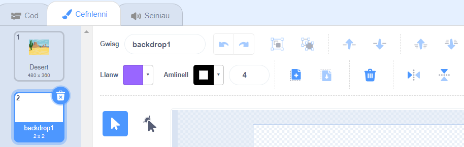

Cer i'r ddewislen **Dewiswch Gefnlen** a chlicio ar **Paent**:

Byddi di'n cael dy dywyd i'r golygydd Paent, lle bydd y gefnlen newydd yn cael ei hamlygu yn y rhestr. Os oes gen ti gefnlenni eraill yn dy brosiect, byddi di hefyd yn eu gweld ar y rhestr.

I osod prif liw'r gefnlen clicia ar yr offeryn **petryal**, wedyn defnyddio'r dewiswr lliw **Llenwi** i ddewis lliw, wedyn llusga'r siâp dros gynfas llawn y gefnlen:

 

Os wyt ti am ychwanegu mwy o fanylion i dy gefnlen, galli di ddefnyddio'r offeryn **petryal**, yr offeryn **Cylch**, neu'r offeryn **Brwsh**, neu gyfuniad o'r tri!

Ar ôl i ti orffen, gwna'n siŵr dy fod yn rhoi enw sy'n gwneud synnwyr i dy gefnlen newydd:

Bydd dy gefnlen newydd yn cael ei dangos ar y Llwyfan a bydd ar gael i'w defnyddio mewn blociau `Edrychiad`{:class="block3looks"}.

