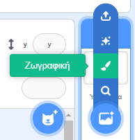
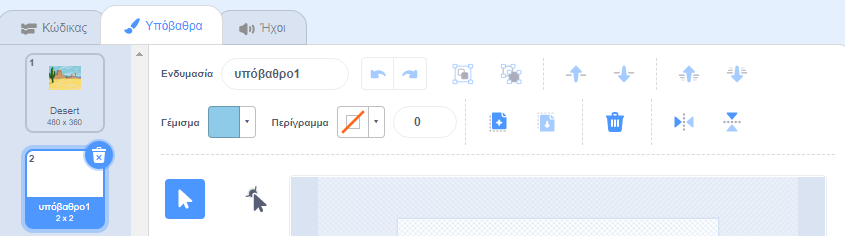
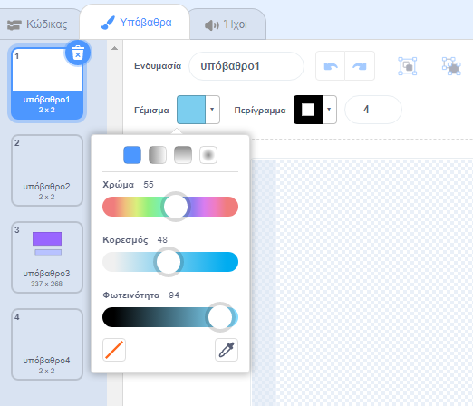
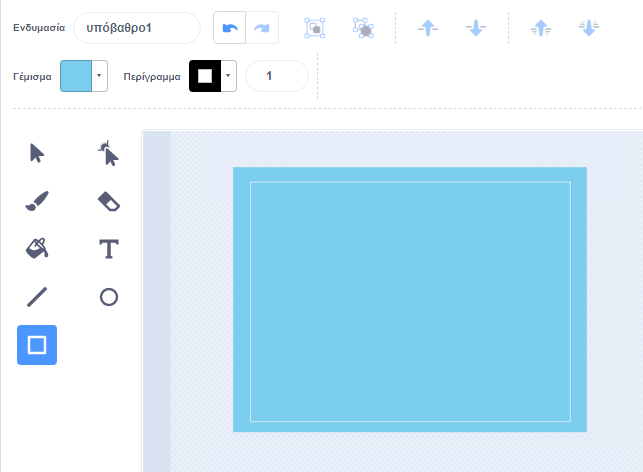
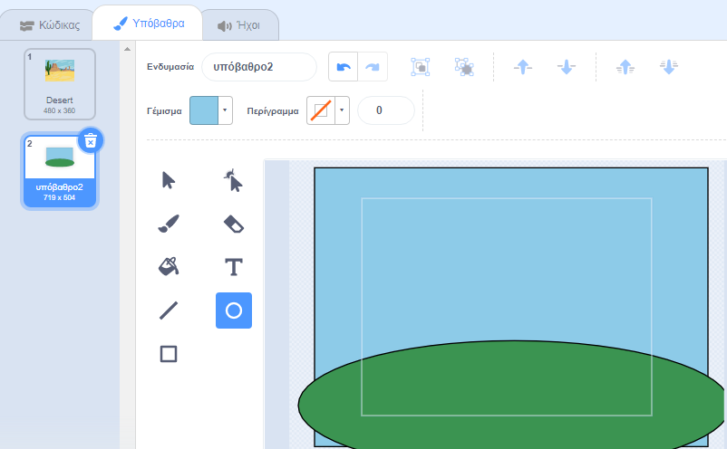
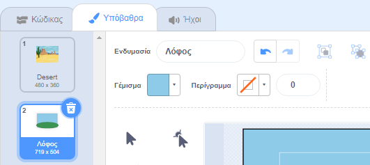
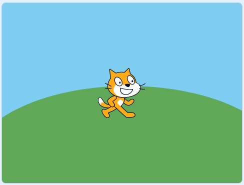

Πήγαινε στο μενού **Επιλέξτε Υπόβαθρα** και κάνε κλικ στην επιλογή **Ζωγραφική**:

Θα μεταφερθείς στον επεξεργαστή ζωγραφικής, όπου το νέο υπόβαθρο θα επισημανθεί στη λίστα. Αν υπάρχουν και άλλες Ενδυμασίες Υποβάθρου στο έργο σου θα εμφανίζονται επίσης στη λίστα.

Για να ορίσεις το κυρίως χρώμα του νέου Υπόβαθρου, κάνε κλικ στο εργαλείο **Τετράγωνο**, κατόπιν χρησιμοποίησε τον επιλογέα **Γέμισμα** για να επιλέξεις ένα χρώμα, στη συνέχεια σύρε το σχήμα πάνω στον πλήρη καμβά:

 

Εάν θέλεις να προσθέσεις περισσότερες λεπτομέρειες στην Ενδυμασία Υποβάθρου σου, μπορείς να χρησιμοποιήσεις το εργαλείο **ορθογώνιο**, το εργαλείο **κύκλος**, το εργαλείο **γέμισμα** - ή έναν συνδυασμό και των τριών!

Όταν τελειώσεις, βεβαιώσου πως έχεις δώσει στο νέο σου υπόβαθρο ένα όνομα που να έχει νόημα:

Το νέο σου σκηνικό θα εμφανίζεται στη σκηνή και θα είναι διαθέσιμο για χρήση στο μπλοκ `Όψεις`{: class = "block3looks"}.

