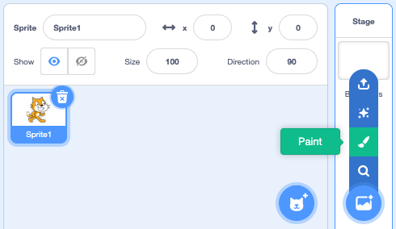
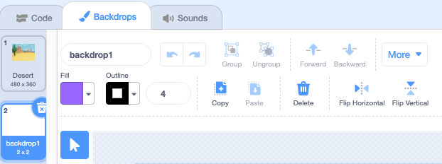
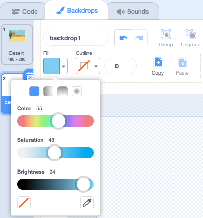
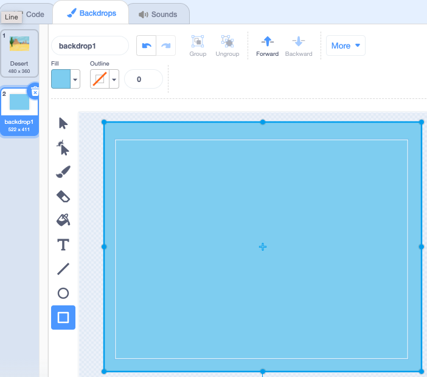
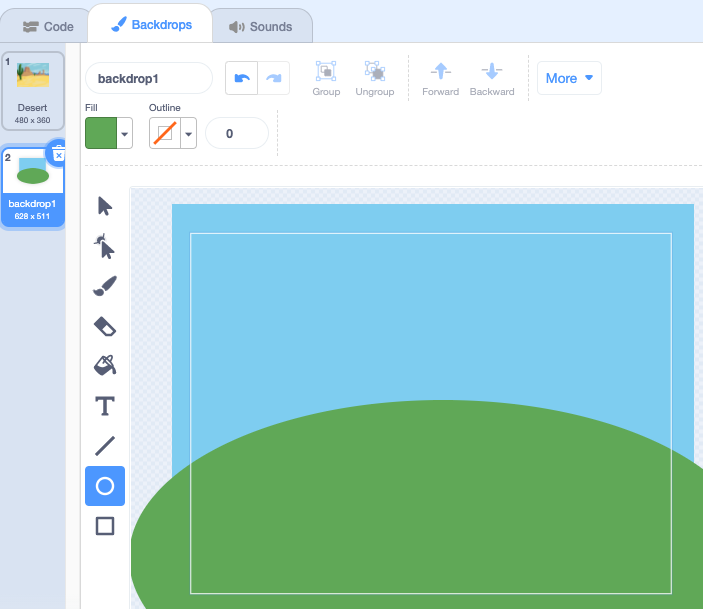
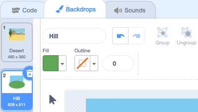

## Paint a new backdrop

Click on **Paint** from the **Choose a Backdrop** menu

You will be taken to the Scratch Paint editor with the new backdrop highlighted. If you have other backdrops in your project you will also see them in the list.

To set the main backdrop colour, click on the **Rectangle** tool. Use the **Fill** colour chooser to select a colour and drag the shape over the full backdrop canvas. 

If you want to add more details to your backdrop you can use the **Rectangle** tool, **Circle** tool, **Paint** tool - or a combination of all three!   

When you are finished, don’t forget to give your new backdrop a sensible name.

Your new backdrop will be shown on the Stage and available to use in the `Looks`{:class="block3looks"} blocks.

