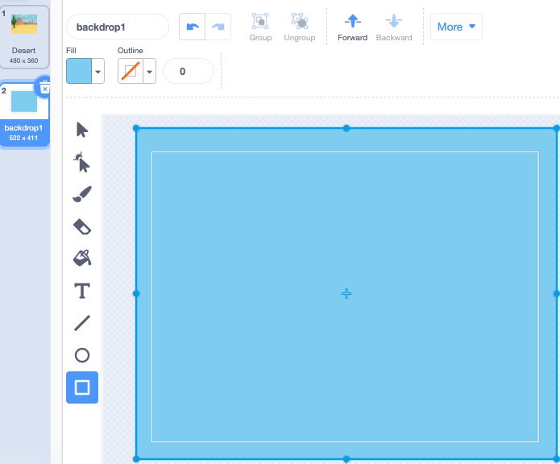
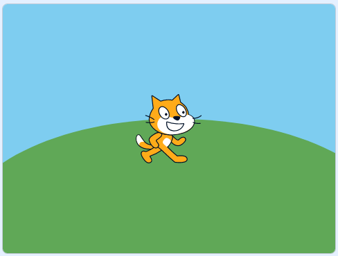

Click on **Paint** in the **Choose a Backdrop** menu.

You will be taken to the Scratch Paint editor with the new backdrop highlighted. If you have other backdrops in your project, you will also see them in the list.

To set the main colour of the backdrop, click on the **Rectangle** tool. Use the **Fill** colour chooser to select a colour, and drag the shape over the full backdrop canvas. 

If you want to add more details to your backdrop, you can use the **Rectangle** tool, **Circle** tool, **Paint** tool, or a combination of all three!   

When you have finished, make sure that you give your new backdrop a sensible name.

Your new backdrop will be shown on the Stage and available to use in the `Looks`{:class="block3looks"} blocks.

