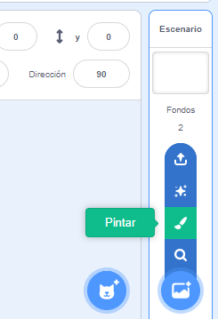
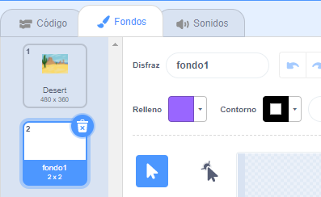
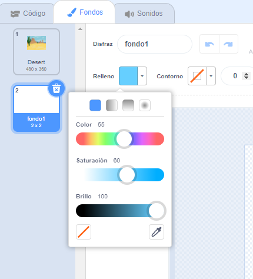
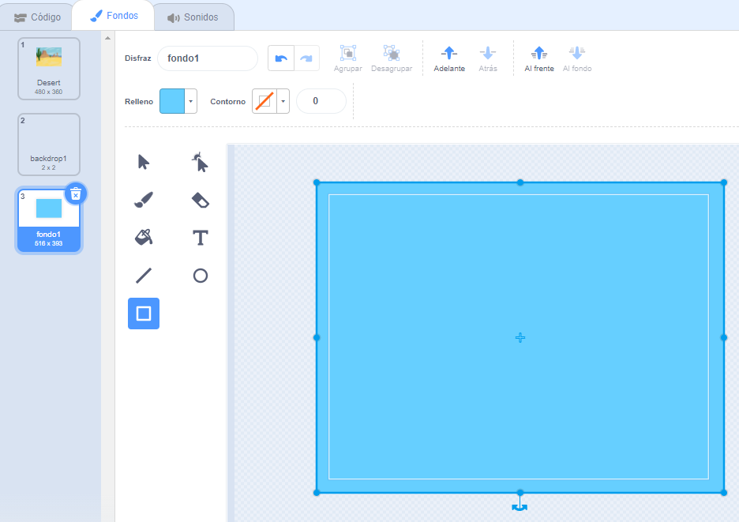
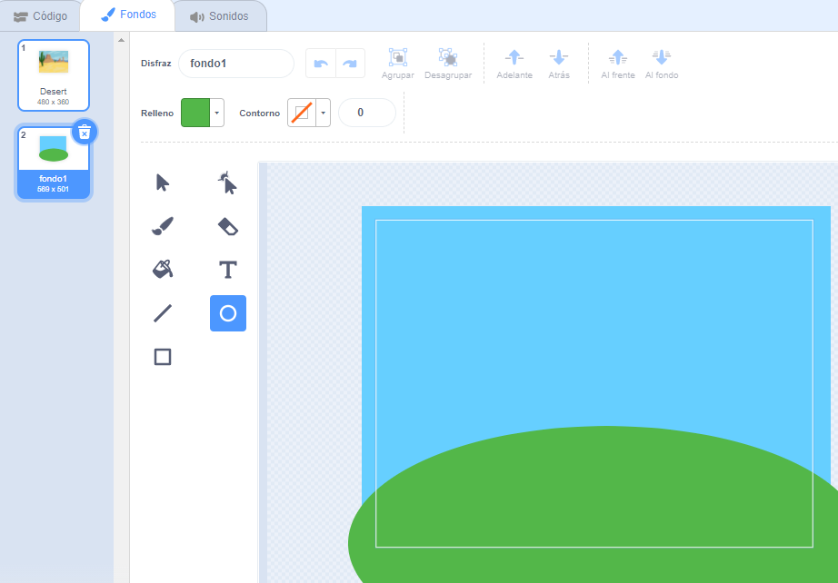
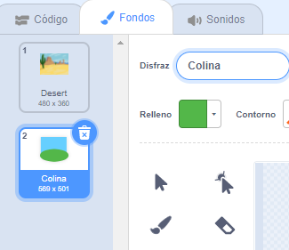

Ve al menú **Elige un Fondo** y selecciona la opción **Pintar**:

Se te dirigirá al Editor de dibujo, donde el nuevo fondo se resaltará en la lista. Si tienes otros fondos en tu proyecto, también los verás en la lista.

Para establecer el color principal del fondo, haz clic en la herramienta **Rectángulo**, luego usa el selector de color en **Relleno** para elegir un color, luego arrastra la forma para que cubra el lienzo de fondo completamente:

 

Si deseas agregar más detalles a tu fondo, puedes usar la herramienta **Rectángulo**, la herramienta **Círculo**, la herramienta **Pincel**, ¡o una combinación de las tres!

Cuando hayas terminado, asegúrate de darle a tu nuevo fondo un nombre que tenga sentido:

Tu nuevo fondo se mostrará en el escenario y estará disponible para usar en los bloques `Apariencia`{:class="block3looks"}.

