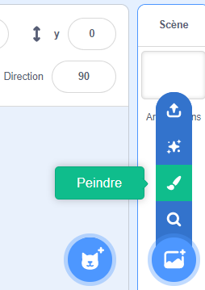
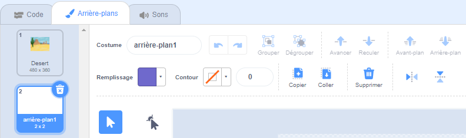
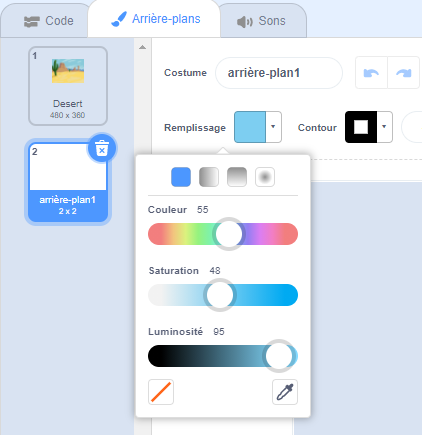
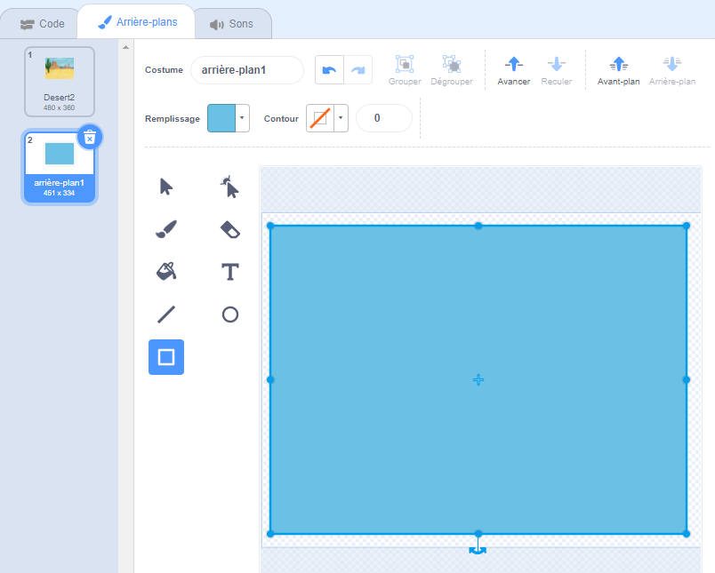
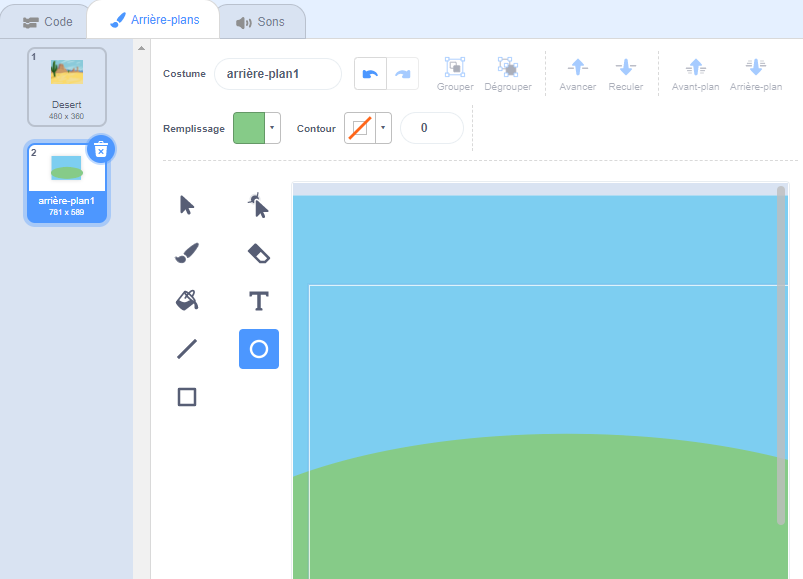
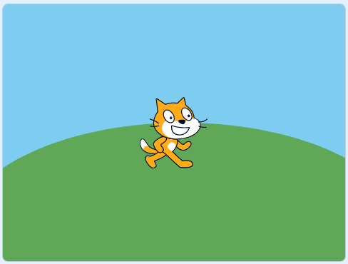

Va dans le menu **Choisir un arrière-plan** et sélectionne l'option **Peindre** :

Tu seras dirigé vers l'éditeur de peinture, où le nouvel arrière-plan sera mis en surbrillance dans la liste. Si tu as d'autres arrière-plans dans ton projet, tu les verras également dans la liste.

Pour définir la couleur principale de l'arrière-plan, clique sur l'outil **Rectangle**, puis utilise le sélecteur de couleur **Remplissage** pour sélectionner une couleur, puis fais glisser la forme sur tout le canevas de l'arrière-plan :

 

Si tu souhaites ajouter plus de détails à ton arrière-plan, tu peux utiliser l'outil **Rectangle** **Cercle** ou l'outil **Pinceau** , ou une combinaison des trois !

Lorsque tu as terminé, assure-toi de donner à ton nouvel arrière-plan un nom approprié :

Ton nouvel arrière-plan sera affiché sur la scène et utilisable dans les blocs `Apparence`{:class="block3looks"}.

