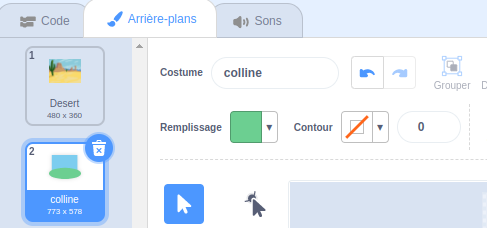

Clique sur **Peindre** dans le menu **Choisir un arrière-plan**

Tu seras redirigé vers l'éditeur de peinture Scratch avec le nouvel arrière-plan en surbrillance. Si tu as d'autres arrière-plans dans ton projet, tu les verras également dans la liste.

Pour définir la couleur principale de l'arrière-plan, clique sur l'outil **Rectangle**. Utilise le sélecteur de couleur **Remplissage** pour sélectionner une couleur et fais glisser la forme sur tout le canevas de l'arrière-plan.

 

Si tu souhaites ajouter plus de détails à ton arrière-plan, tu peux utiliser l'outil **Rectangle**, l'outil **Cercle**, l'outil **Peinture** - ou une combinaison des trois !

Quand tu as terminé, n’oublie pas de donner à ton nouvel arrière-plan un nom approprié.

Ton nouvel arrière-plan sera affiché sur la scène et utilisable dans les blocs `Apparence`{:class="block3looks"}.

