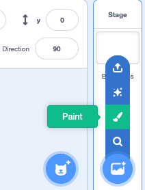
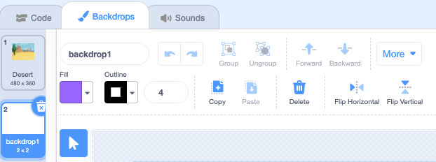
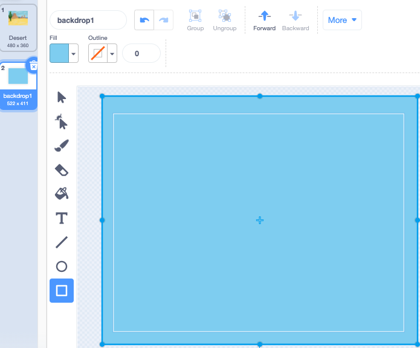
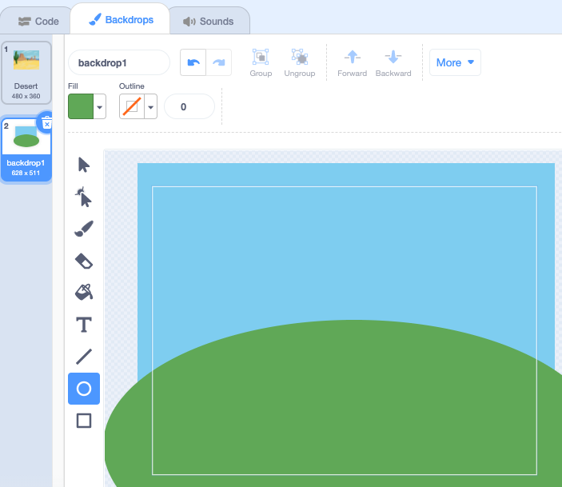

**Choose a Backdrop** (एक पृष्ठभूमि चुनें) मेनू पर जाएं और **Paint** (पेंट) पर क्लिक करें:

आपको पेंट संपादक पर ले जाया जाएगा, जहां सूची में नई पृष्ठभूमि को हाइलाइट किया होगा। यदि आपके प्रोजेक्ट में अन्य पृष्ठभूमि हैं, तो आप उन्हें सूची में भी देखेंगे।

पृष्ठभूमि का मुख्य रंग सेट करने के लिए, **आयत** उपकरण पर क्लिक करें, फिर रंग चुनने के लिए **भरण** रंग चयनकर्ता का उपयोग करें, फिर आकृति को पूर्ण पृष्ठभूमि कैनवास पर खींचें:

 

यदि आप अपनी पृष्ठभूमि में अधिक विवरण जोड़ना चाहते हैं, तो आप **आयत** उपकरण, **मंडल** उपकरण, या **ब्रश** उपकरण, या तीनों के संयोजन का उपयोग कर सकते हैं!

जब आप समाप्त कर लें, तो सुनिश्चित करें कि आप अपनी नई पृष्ठभूमि को एक ऐसा नाम दें जो समझ में आए:

आपकी नई पृष्ठभूमि स्टेज पर दिखाई जाएगी और `लुक्स`{:class="ब्लॉक3लुक"} ब्लॉक में उपयोग के लिए उपलब्ध होगी।

