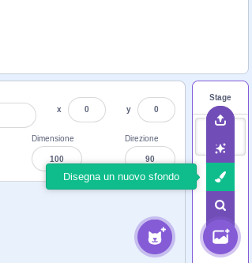
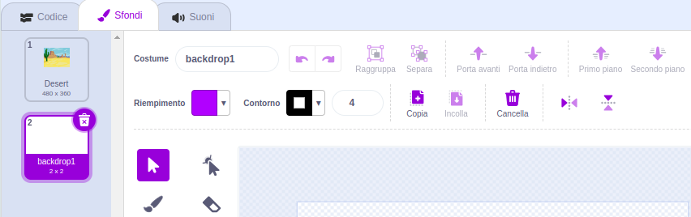
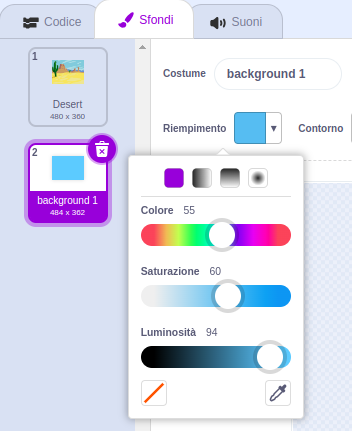
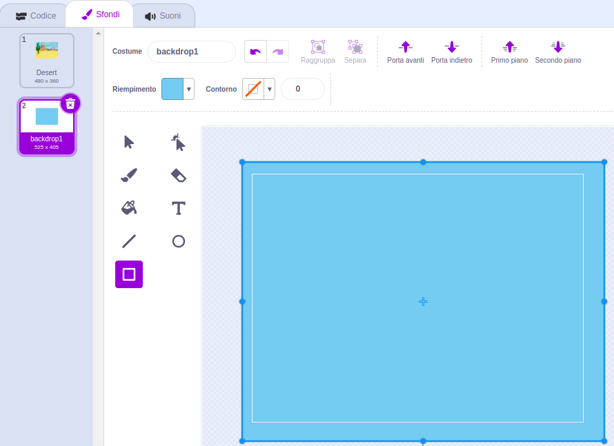
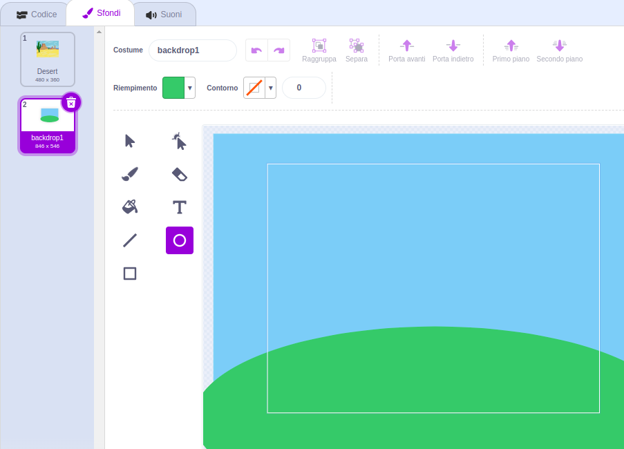
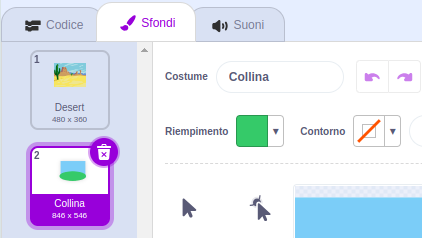

Apri il menu **Scegli uno sfondo** e fai clic su **Disegna uno Sfondo**:

Si aprirà l'editor di Paint, dove il nuovo sfondo sarà evidenziato nell'elenco. Se hai altri sfondi nel tuo progetto, vedrai anche questi nella lista.

Per impostare il colore principale dello sfondo, fai clic sullo strumento **Rettangolo**, quindi utilizza il selettore **Riempimento** per selezionare un colore, quindi trascina la forma sull'intera tela dello sfondo:

 

Se desideri aggiungere ulteriori dettagli al tuo sfondo, puoi utilizzare lo strumento **Rettangolo**, **Cerchio** o **Pennello** o una combinazione di tutti e tre!

Quando hai finito, assicurati di dare al tuo nuovo sfondo un nome che abbia un senso:

Il tuo nuovo sfondo verrà mostrato sullo Stage e sarà disponibile per l'uso nei blocchi `Aspetto`{:class="block3looks"}.

