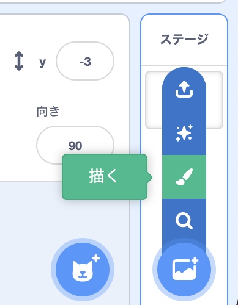
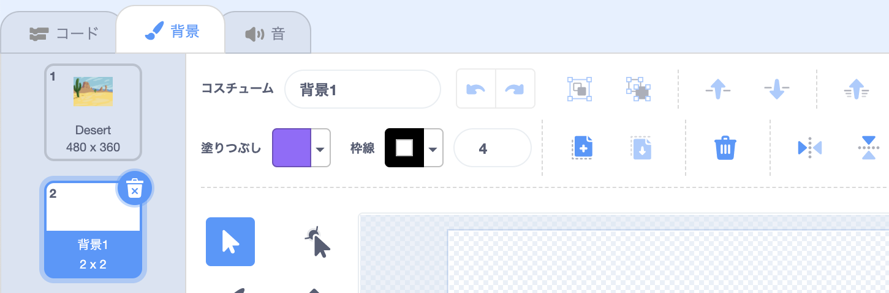
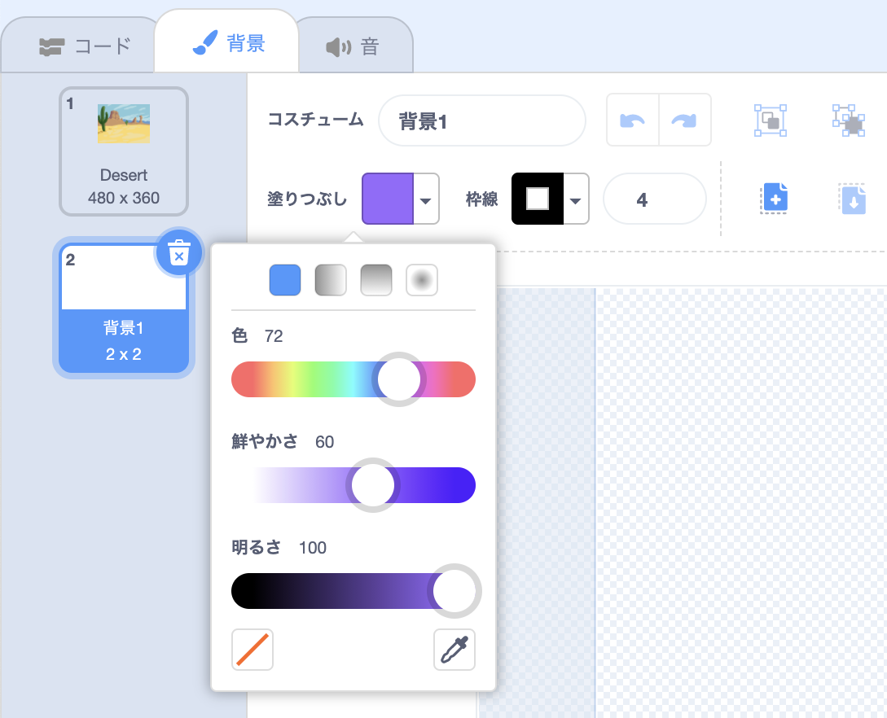
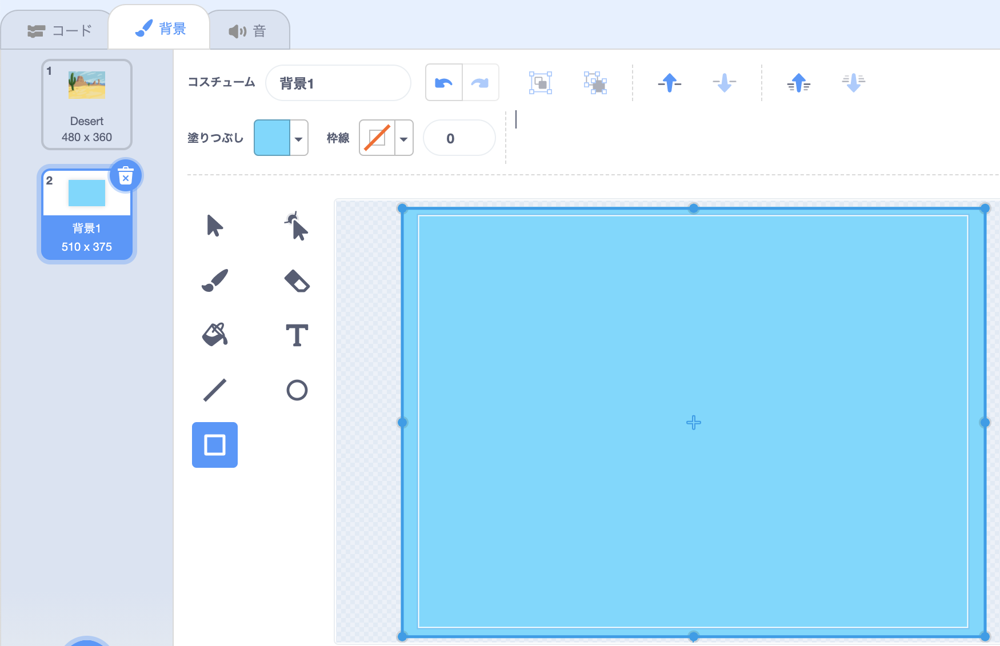
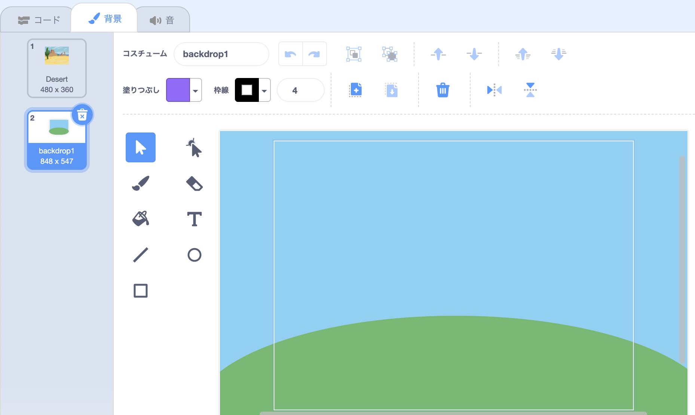
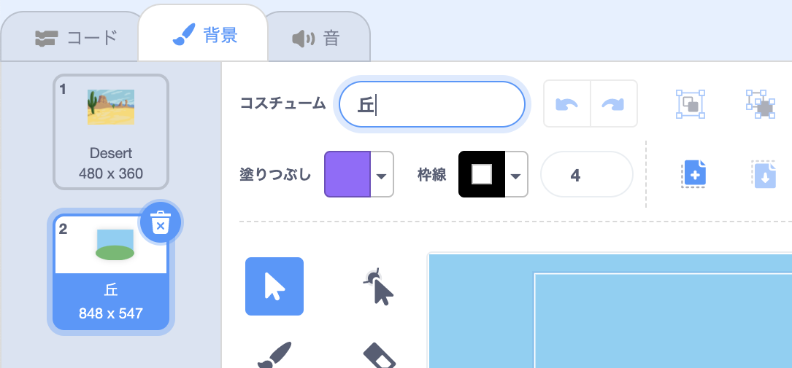

**背景を選ぶ**メニューの、 **ペイント**をクリックします。

ペイントエディタに移動し、新しい背景がリストで強調表示されます。 プロジェクトに他の背景がある場合は、それらもリストに表示されます。

背景のメインカラーを設定するには、 **四角形** ツールをクリックし、 **塗りつぶし**の カラーチューザーを使用して色を選択した後、背景キャンバス全体にドラッグします。

 

背景をさらに細かく描きたい場合は、 **四角形** ツール、 **円** ツール、 **筆** ツール、またはそれら3つを組み合わせて使用することが出来ます。

終了したら、新しい背景にすきな名前を付けてください。

新しい背景がステージに表示され、 `見た目`{:class="block3looks"}ブロックで使用できるようになります。

