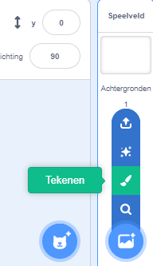
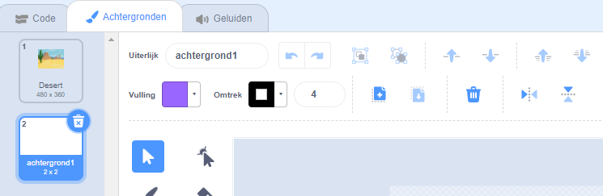
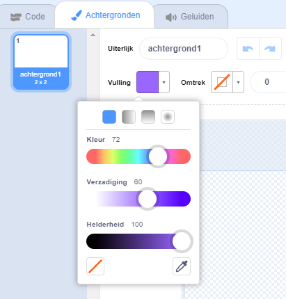
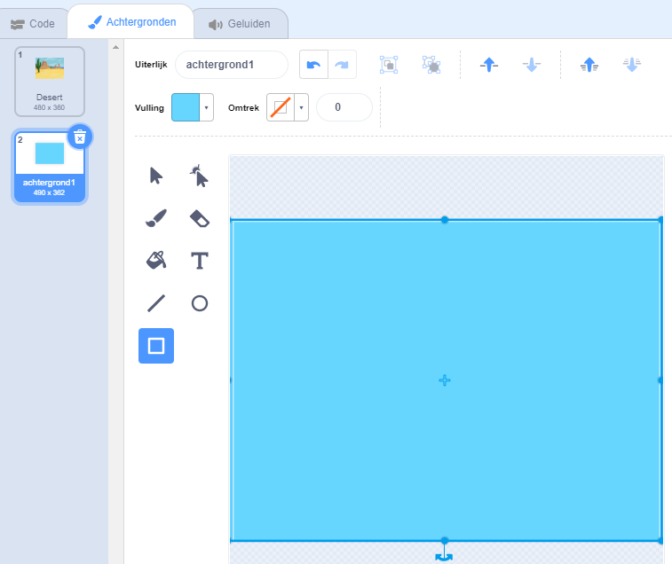
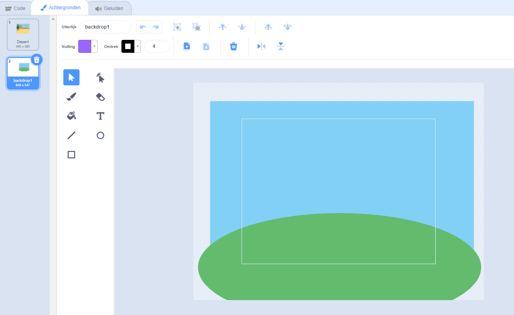
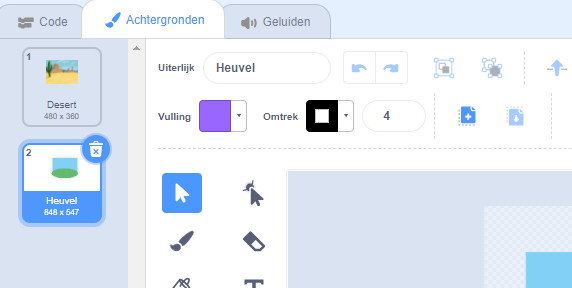

Ga naar het **Kies een achtergrond** menu en kies **Tekenen**:

De Teken editor opent dan, waar de nieuwe achtergrond in de lijst wordt gemarkeerd. Als je andere achtergronden in je project hebt, zul je deze ook in de lijst zien.

Om de hoofdkleur van de achtergrond in te stellen, klik je op het **Rechthoek** gereedschap en gebruik je vervolgens de **Vulling** kleurkiezer om een kleur te selecteren en sleep je de vorm over de volledige achtergrond:

 

Als je meer details aan je achtergrond wilt toevoegen, kun je het gereedschap **Rechthoek**, **Cirkel** of **Kwast** gebruiken - of een combinatie van alle drie!

Als je klaar bent, zorg er dan voor dat je je nieuwe achtergrond een logische naam geeft:

Je nieuwe achtergrond wordt in het werkgebied getoond en is beschikbaar voor gebruik in de `Uiterlijken`{:class="block3looks"} codeblokken.

