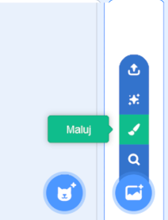
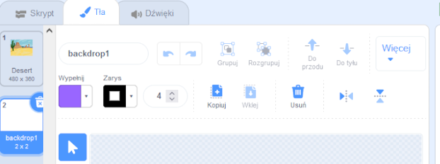
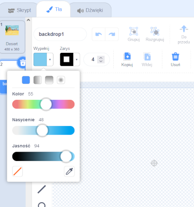
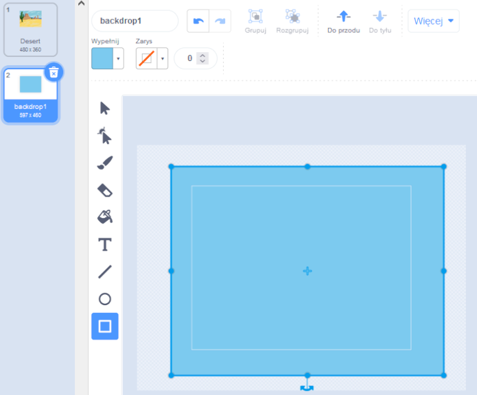
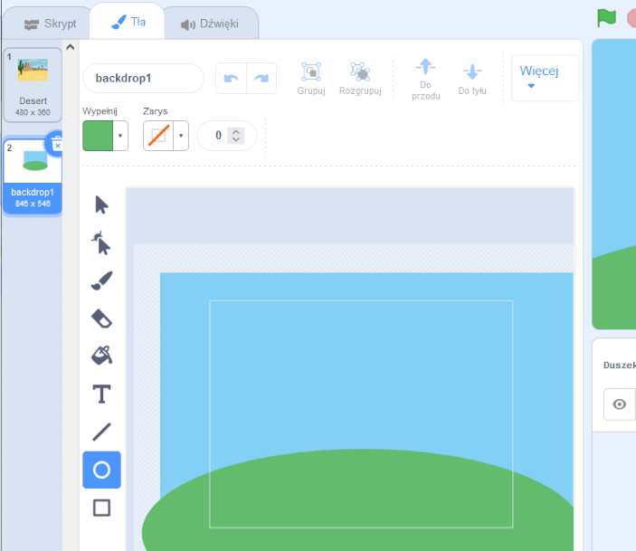
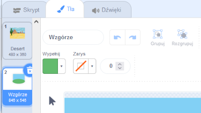

Przejdź do menu **Wybierz tło** i kliknij **Maluj**:

Zostaniesz przeniesiony do edytora Malowania, gdzie na liście zostanie podświetlone nowe tło. Jeśli w swoim projekcie masz inne tła, zobaczysz je również na liście.

Aby ustawić główny kolor tła, kliknij narzędzie **Prostokąt**, potem użyj **Wypełnij** aby wybrać kolor, a następnie rozciągnij kształt na obszar całego tła:

 

Jeśli chcesz dodać więcej szczegółów do tła, możesz użyć narzędzia **Prostokąt**, **Okrąg** lub **Pędzel** lub kombinacji wszystkich trzech!

Po zakończeniu upewnij się, że nadałeś nowemu tłu logiczną nazwę:

Twoje nowe tło zostanie pokazane na scenie i będzie dostępne do użycia w blokach `Wygląd`{:class="block3looks"}.

