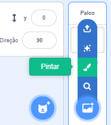
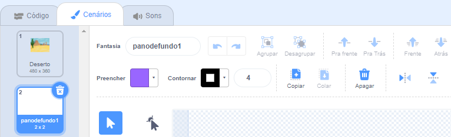
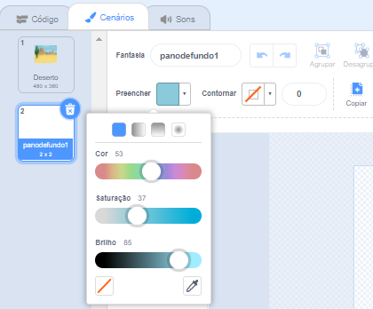
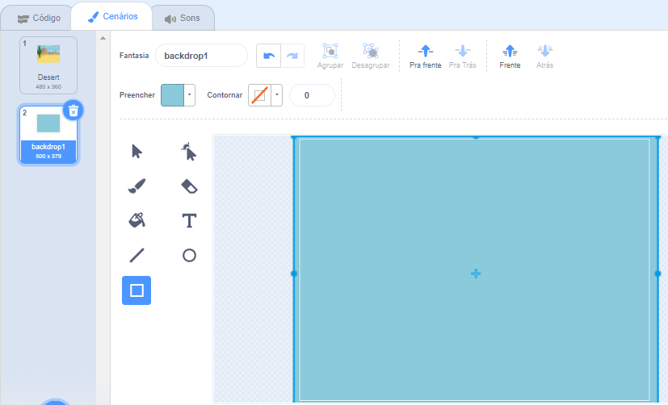
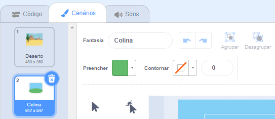

Vá para o menu **Escolha um cenário** e selecione a opção **pintar**:

Você será levado ao editor do Paint, onde o novo pano de fundo será destacado na lista. Se você tiver outros cenários no seu projeto, também os verá na lista.

Para definir a cor principal do cenário, clique no **Retângulo** e use o **Preencher** para selecionar uma cor e arraste a forma sobre a tela inteira do cenário:

 

Se você quiser adicionar mais detalhes ao seu cenário, pode usar a ferramenta **Retângulo** ferramenta, **Círculo**, ferramenta, ou **Pintar** - ou uma combinação das três!

Quando terminar, certifique-se de dar ao seu novo cenário, um nome que faça sentido:

Seu novo cenário será exibido no Palco e estará disponível para uso `Aparência`{:class="block3looks"}blocos.

