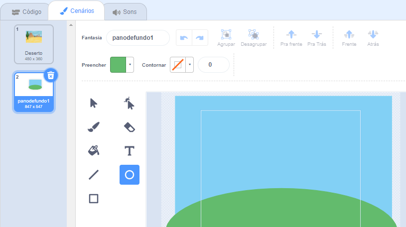

Vá para o menu **Selecionar Cenário** e clique em **Pintar**:

Você será levado ao editor do Paint, onde o novo pano de fundo será destacado na lista. Se você tiver outros cenários no seu projeto, também os verá na lista.

Para definir a cor principal do cenário, clique na ferramenta **Retângulo** e use o **Preencher** para selecionar uma cor, então arraste a forma sobre a tela inteira do cenário:

 

Se você quiser adicionar mais detalhes ao seu cenário, você pode usar a ferramenta **Retângulo**, a ferramenta **Círculo**, a ferramenta **Pintar** ou uma combinação das três!

Quando terminar, certifique-se de dar ao seu novo cenário, um nome que faça sentido:

Seu novo cenário será exibido no Palco e estará disponível para uso nos blocos `Aparência`{:class="block3looks"}.

