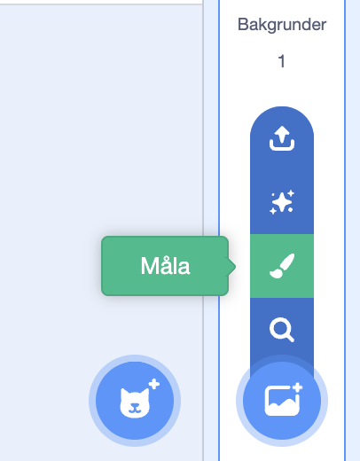
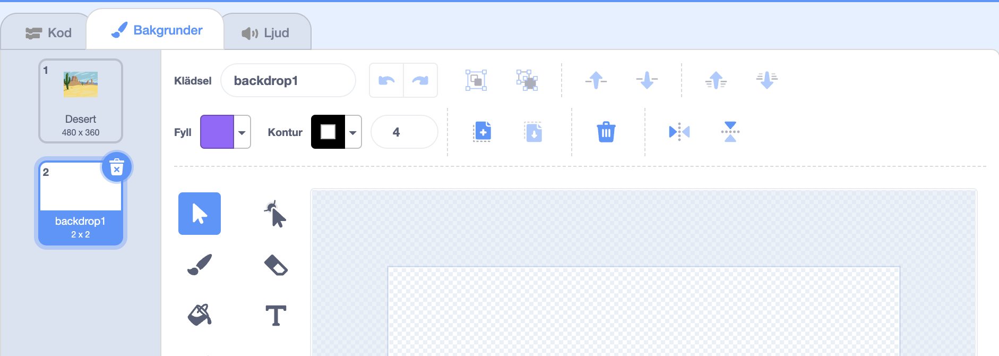
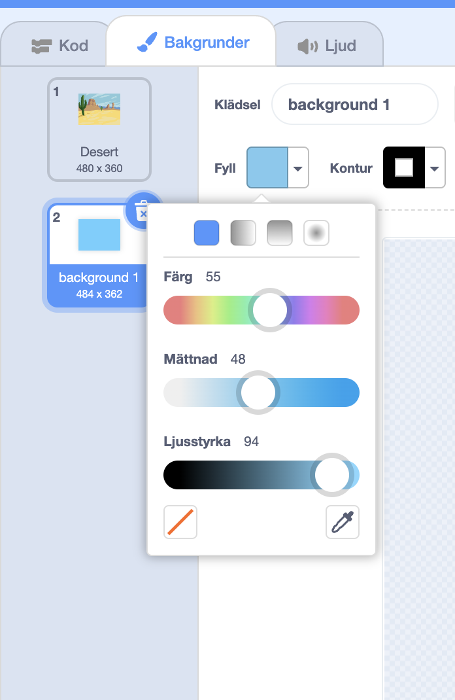
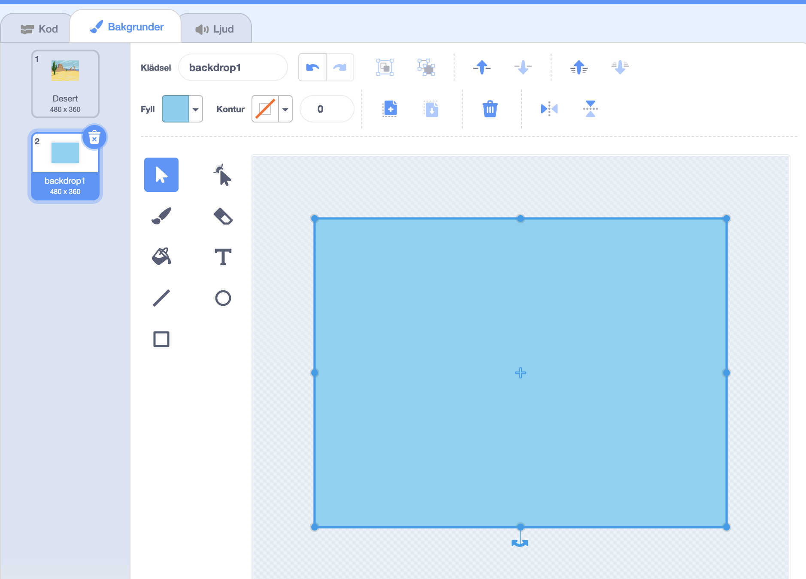
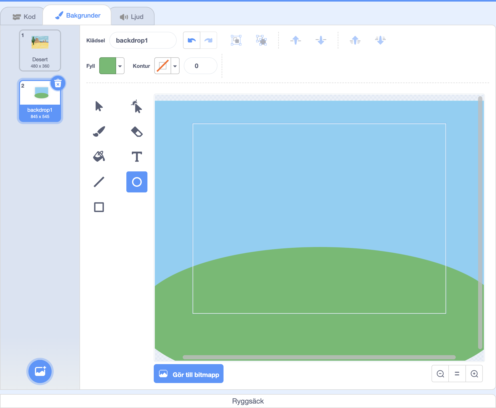
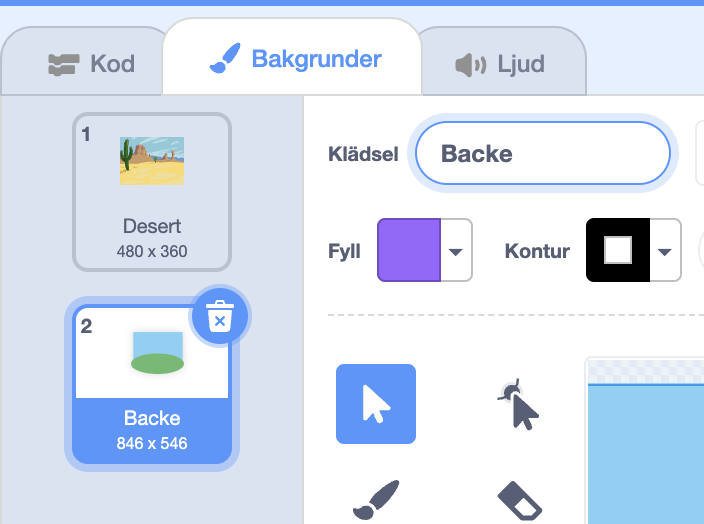

I **Välj en bakgrund**-menyn, klicka på **Färg**:

Du kommer att tas till målarredigeraren där den nya bakgrunden kommer att markeras i listan. Om du har andra bakgrunder i ditt projekt kommer även dessa finnas på listan.

För att ställa in bakgrundens huvudfärg, klicka på **rektangel**verktyget, använd färgväljaren **fyll** och dra sedan formen över hela bakgrundsduken:

 

Om du vill lägga till fler detaljer till din bakgrund kan du använda verktyget **rektangel**verktyget, **cirkel**verktyget eller **borste**verktyget, eller en kombination av alla tre!

När du är klar, se till att du ger din nya bakgrund ett logiskt namn:

Din nya bakgrund kommer att visas på scenen och kommer att vara tillgänglig att använda i `Utseende`{:class="block3looks"}-block.

