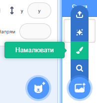
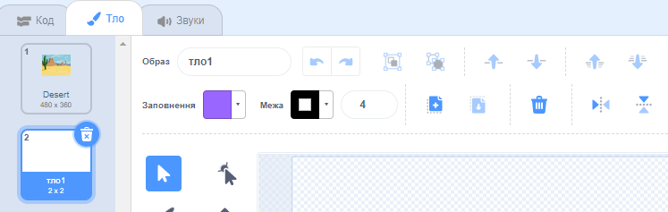
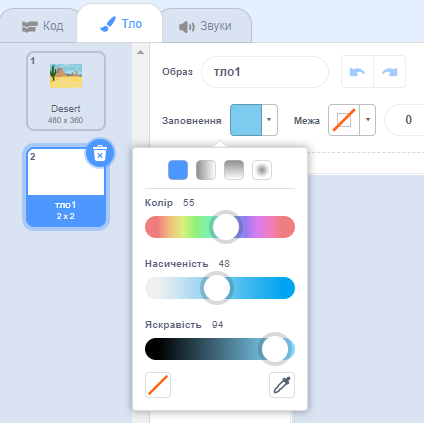
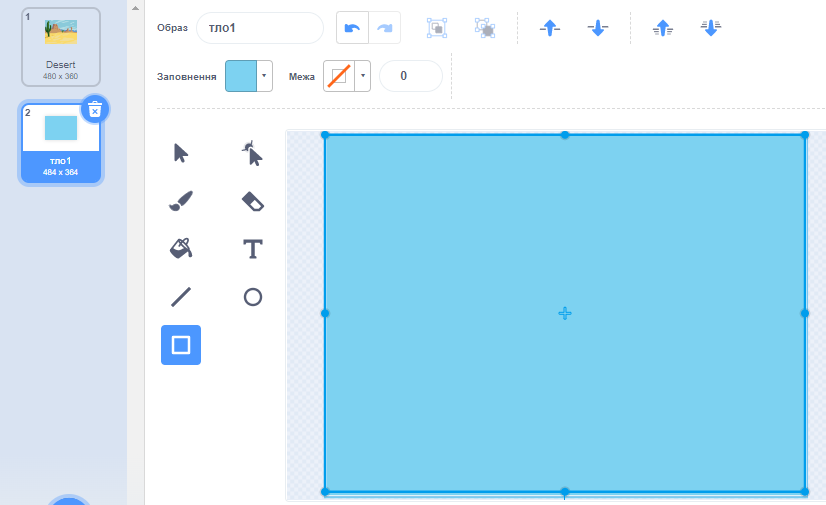
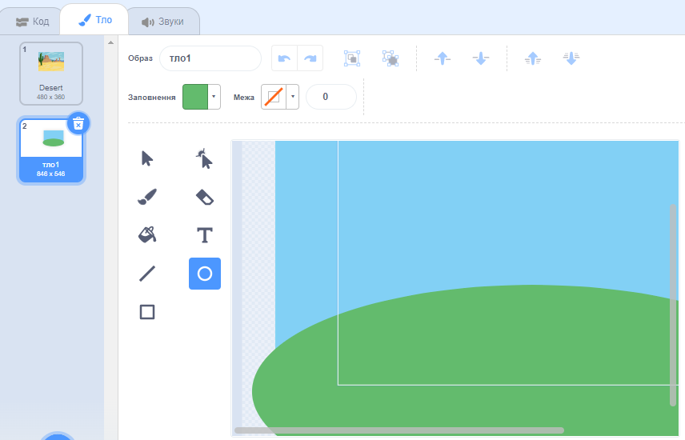
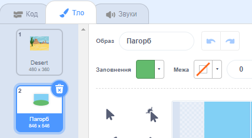

Перейди в меню **Обрати тло** і натисни **Намалювати**:

Ти потрапиш в Редактор малювання, де нове тло буде виділено у списку. Якщо у твоєму проєкті є інші тла, ти також побачиш їх у списку.

Щоб задати основний колір тла, натисни на інструмент **Прямокутник**, потім за допомогою панелі вибору кольору **Заливки** вибери колір, а потім перетягни фігуру по всьому полотну тла:

 

Якщо ти хочеш додати більше деталей до тла, використовуй інструмент **Прямокутник**, або інструмент **Коло**, або інструмент **Пензель**, або комбінацію всіх трьох інструментів!

Завершивши, переконайся, що ти дав своєму новому тлу логічну назву:

Твоє нове тло буде відображатись на Сцені й буде доступним для застосування у блоках `Вигляд`{:class="block3looks"}.

